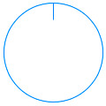
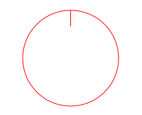
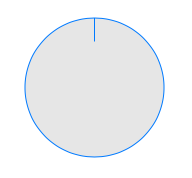
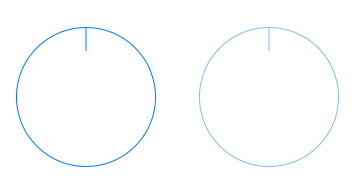

# iOS Knob Control
This is a simple iOS knob control implemented in Swift as a UIControl subclass. It is rotated with a single finger pan and is continuous, meaning you can rotate it 360°.



Read about its development at [Knob: Subclassing UIControl with Swift](http://iosdevstuff.blogspot.com/2015/09/knob-subclassing-uicontrol-with-swift.html).

## Usage

Copy Knob.swift into your project. It implements UIControl's Target-Action interface. When rotated it generates UIControlEvents.ValueChanged. Get the current rotation from the value property, expressed as radians in the clockwise direction (0 to 2 * M_PI). Example:

```
override func viewDidLoad() {
    super.viewDidLoad()
        
    let knob = Knob(frame: CGRect(x: 20, y: 20, width: 100, height: 100))
    self.view.addSubview(knob)
    knob.addTarget(self, action: "knobRotated:", forControlEvents: .ValueChanged)
}

func knobRotated(knob: Knob) {
    print("value: \(knob.value)")
}
```
### tintColor
Use tintColor to change the color of the outline and indicator mark.



```
knob.tintColor = UIColor.redColor()
```
### backgroundColor
Use backgroundColor to change the fill color.


```
knob.backgroundColor = UIColor(white: 0.9, alpha: 1.0)
```
### enabled
Set enabled to false to disable touch events. The stroke and fill color will be modified subtly to indicate the control is disabled.


```
leftKnob.enabled = true
rightKnob.enabled = false
```
## License

Knob is available under the MIT license. See the LICENSE file for more info.
